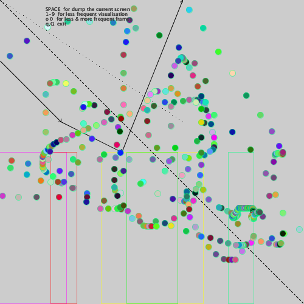

Additional functionalities for simulation application templates
================================================================
### @date 2024-09-26 (last modification)

   *   _Optionals.pde_  :  File forcing all "optionales" to be loaded from this folder 

   *   _aDummyTypes.pde_  :  Classes for making an object from a simple types as `int`, `boolean`, `float` & `double`.

   *   _aInterfaces.pde_  :  Common INTERFACES like `iNamed`, `iDescribable`, `iColorable`, `iPositioned` & `Function2D`

   *   _aPair.pde_  :  `Pair` is one of the very COMMONLY used and usable TEMPLATE.

   *   _rtmCmdLine.pde_  :  Example of function handling of program call parameters, if available.

   *   _rtmDraw.pde_  :  `draw()` example with possibility of non-visible window.

   *   _rtmEvents.pde_  :  Example of a keyboard event handling.

   *   _rtmExit.pde_  :  Example of a handling of exit from aplication (mainly closing open files!) 

   *   _rtmMenu.pde_  :  Example of the function that allows to construct the window menu in the setup. 

   *   _rtmMouse.pde_  :  Examples for handling mouse events

   *   _uCharts.pde_  :  Functions & classes useable for making charts.

   *   _uEngNames.pde_  :  Tables of English names popular in 1880

   *   _uFigures.pde_  :  Various shapes drawing procedures.

   *   _uFileAppend.pde_  :  Tools for opening & appending text/csv files.

   *   _uGDashedLine.pde_  :  Function for drawing dashed lines.

   *   _uGDottedLine.pde_  :  Functions for drawing dotted lines.

   *   _uGraphix.pde_  :  Various helpful drawing procedures, like crosses, polygons & bar3D

   *   _uGRectAreas.pde_  :  "Active rectangles" - proprietary application interface module in Processing.

   *   _uMathBasic.pde_  :  Some math basics: `sign`, `upToTresh`(-hold) & `whichIsMax`

   *   _uMathBits.pde_  :  Bit tools

   *   _uMathLog.pde_  :  Handy logarithms and around

   *   _uMathSqr.pde_  :  Functions for easy and READABLE in squaring expressions

   *   _uMDistances.pde_  :  Different ways to calculate Euclid distances in 2D (flat and torus).

   *   _uMGeom2D.pde_  :  Some 2D Geometry calculations: `nearestPoints` and so...

   *   _uRandoms.pde_  :  Functions that improve the use of pseudo-random numbers

   *   _uStatistics.pde_  :  Various simple statistics for one-dimensional arrays

   *   _uStatOfAgents.pde_  :  A template of making a histogram from an example agent with "A" field
   
   *   _uVideo.pde_  :  Tool for made video from simulation 
   
   
   

   

