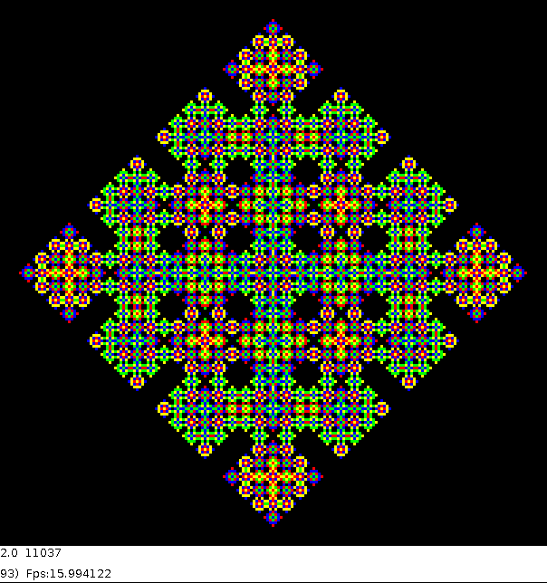

# sym4processing - various simulation resources in processing
## @date 2024-09-26 (last modification)

Processing files supporting various simulation applications and giving them 
selected possibilities and properties:

* A design template for __CA__ ( __Cellular Automata__ ) applications.
* A design template for __ABM__( __Agent Base Modeling)  simulations with the 
  possibility of expanding with a network structure, suitable for many purposes.
* IP-network game template for **one server - many clients** simulational games.
* Additional optional source code modules for working with application 
  templates. This set includes tools for generating artificial complex networks 
  (not necessarily neural), collecting simulation data, calculating their 
  statistics and visualizing them during the simulation.
* Sample simulations written using these templates
* As a submodule, it imports a repository with materials for the course 
  "Processing in education and simulation" (**bookProcessingPL**)

More documentation is in the source files, prepared to generate documentation 
in the Doxygen format. Just use *docs/_make_docs.sh* and then see *doxDocs/* .

## REPOSITORY CLONING

```
git clone --recurse-submodules https://github.com/borkowsk/sym4processing.git
```

## DEPENDENCIES

You need to install "com.hamoid" library for **Processing** and "ffmpeg" 
application.

# More materials

## GitHub resources:

* https://github.com/borkowsk/Boca_anticonformists_model
* https://github.com/borkowsk/bookProcessingPL
* https://github.com/borkowsk/bookProcessingEN

## PL: WYWIAD na temat symulacji społecznych na YouTube

* FB: https://www.facebook.com/podejdzNaukovo/videos/516387107100734/
* YT: https://www.youtube.com/watch?v=jdm_O_aWtSI


## PL/EN: Kanały i strony

* FB: https://www.facebook.com/ModelowanieProcesowSpolecznych
* YT: https://www.youtube.com/channel/UCkPtf6-lNlCfNuUdcBgNRug

## Licencing

As long as you prominently display information about the authors 
and sponsors of this repository in a prominent place on a derivative 
project, you are free to use this code for educational and research 
purposes, and to modify it freely.

This repository is sponsored by __Centre For Systemic Risk Analisis__, 
and EU grants: __HumanAI__ & __GuestXR__

### Authors

* Wojciech Tomasz Borkowski
* Andrzej Krzysztof Nowak

### Links

* https://cbrs.uw.edu.pl/en/home-page/
* https://www.humane-ai.eu/
* https://guestxr.eu/




